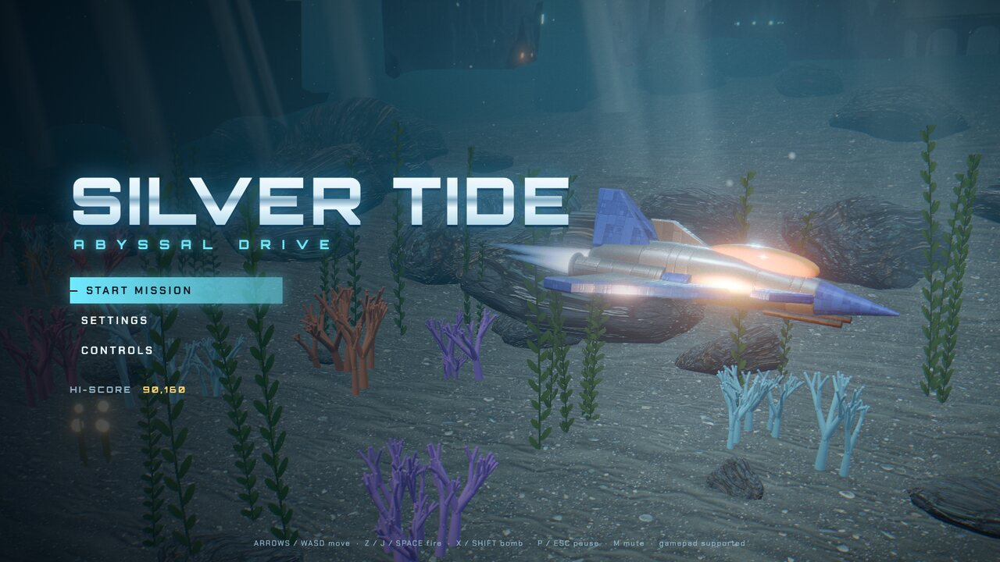
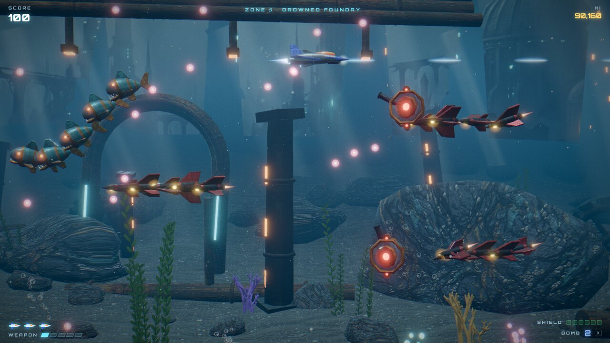
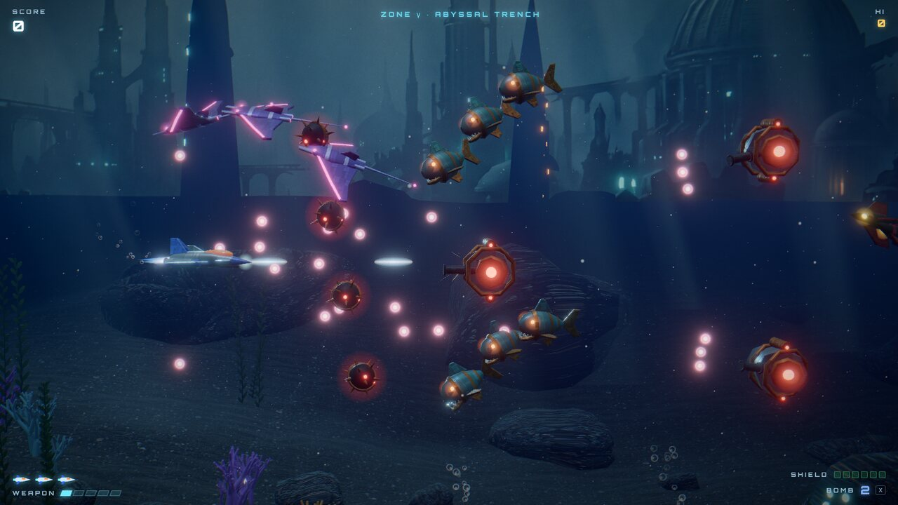
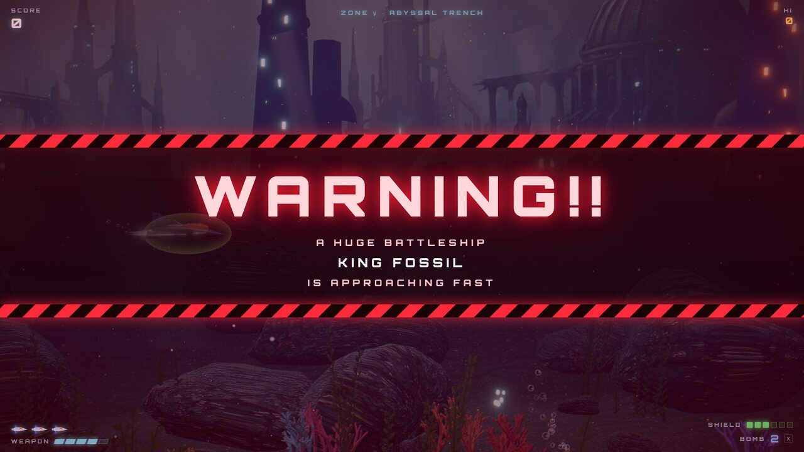
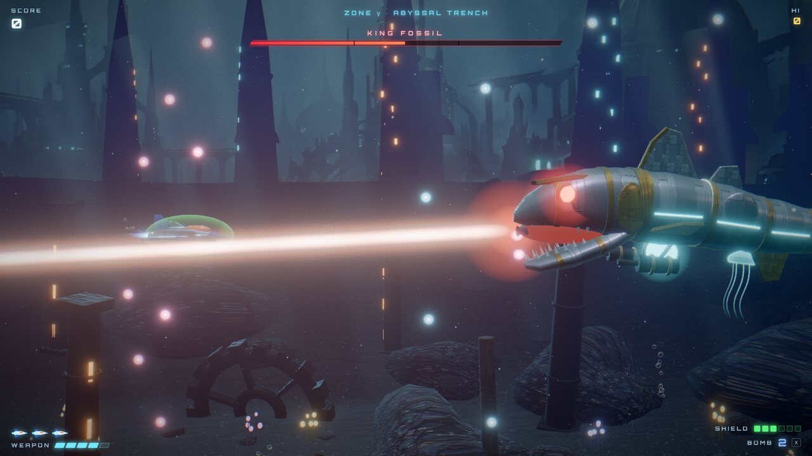

# Silver Tide 3D: Abyssal Drive

A horizontal-scrolling shoot-'em-up in the spirit of **Darius Twin**, rebuilt in
real-time 3D for the browser. Fly a chrome fighter through a drowned mechanical
ocean, blast waves of robotic sea creatures, grab power-ups, and bring down
**KING FOSSIL**, a colossal mechanical coelacanth that rises from the trench.

The gameplay stays on a single plane like the 2D original, with the same
controls, weapons and power-ups. The world around it is fully 3D: a scrolling
seabed, sunken ruins, light shafts, caustics, particles and a post-processed,
bloom-lit look.



| | |
| --- | --- |
|  |  |
|  |  |

## Play

Requires Node.js 20 or later.

```bash
npm install
npm run dev
# open http://localhost:5190
```

Production build:

```bash
npm run build     # outputs static files to dist/
npm run preview   # serves dist/ at http://localhost:4174
```

`dist/` is a static site and can be hosted anywhere (it uses relative paths).

## Controls

| Action | Keyboard | Gamepad |
| ------ | -------- | ------- |
| Move | Arrows / WASD | Left stick / D-pad |
| Fire (hold) | Z / J / Space | A / RT / RB |
| Bomb | X / Shift / K | B / X / LT / LB |
| Pause | P / Esc | Start |
| Mute | M | — |

Some keyboards cannot register Space plus two arrow keys at the same time,
which stops diagonal movement while firing. Fire with **Z** or **J** instead,
or turn on **AUTO-FIRE** in Settings.

### Pickups

- **P**: weapon level up. Five levels, from a single shot to a five-way spread.
- **S**: shield. Absorbs three hits.
- **B**: bomb. Clears enemy bullets and damages everything on screen.

Extra lives at 60,000, 160,000 and 320,000 points.

## The stage

About 84 seconds across three zones, each deeper and darker than the last:

1. **Zone α: Twilight Shelf.** Kelp forests, coral and light shafts from the surface.
2. **Zone β: Drowned Foundry.** Ruined pillars, arches, pipes, giant gears and an overhead pipe ceiling.
3. **Zone γ: Abyssal Trench.** The floor drops away. Bioluminescent plants and jellyfish.

Enemies include drones (some fly in from the background), mecha-piranhas,
mantas, octagonal gun turrets and spiked mines that burst into shrapnel.

Then comes the **WARNING!!**, and the boss. KING FOSSIL fights in three phases
with aimed shots, bullet fans, radial bursts, summoned piranhas, a mouth laser
and a lunge. Its glowing core takes double damage, its two gun pods can be
destroyed, and it sheds armor between phases. Beat it for a score tally, then
continue into a harder loop.

## Settings

Graphics quality (Low / Medium / High / Ultra), music and sound volume, screen
shake, auto-fire and an FPS counter. Settings and the high score are saved in
the browser. Resolution also scales down automatically if frames run long.

## How it is made

- **Engine:** Three.js + TypeScript + Vite. No game framework.
- **Rendering:** PBR materials with a generated underwater environment map,
  shadows, and a shared shader patch that adds animated caustics and
  height-tinted fog to every material. Post-processing (`postprocessing`):
  bloom, AgX tone mapping, vignette, film grain, chromatic-aberration kicks
  and screen shock waves.
- **Models:** every ship, creature and the boss is built in code
  (`src/gfx/models.ts`) from lofted hulls, extruded plates and primitives.
- **World:** a GPU-displaced heightmap seabed, instanced rocks, kelp, coral and
  glow plants, pooled ruins and jellyfish, light shafts, marine snow and a
  matte-painted sunken-city backdrop.
- **Effects:** a GPU particle system (fireballs, sparks, smoke, shock rings,
  bubbles), instanced tumbling debris and pooled flash lights.
- **Textures:** Google Gemini (Nano Banana) generated the seabed, rock and
  rusted-metal textures and the backdrop (sources in `raw-art/`), made
  seamless by `scripts/seamless.py`. Hull panel textures are drawn
  procedurally at runtime.
- **Audio:** `scripts/gen-audio.mjs` is an offline synthesizer (band-limited
  oscillators, filters, FM voices, synthesized drums, reverb, delay, sidechain
  and a limiter). It renders the title, stage and boss themes, two jingles and
  19 sound effects to stereo MP3, with sample-accurate loop points in
  `src/audio/manifest.json`.

## Regenerating assets

The generated assets are committed, so this is only needed after changing the
scripts or the raw art.

```bash
npm run gen:audio      # needs `lame` (brew install lame)
npm run gen:textures   # needs uv and ImageMagick
```

## Development flags

Append to the game URL:

| Flag | Effect |
| ---- | ------ |
| `?autostart` | Skip the title and start the stage |
| `?t=40` | Start at 40 seconds into the stage |
| `?warp=boss` | Jump to the WARNING and boss with a strong weapon |
| `?god` | The player cannot be hit |

## Project layout

```
src/
  main.ts          entry point, fonts, error capture
  config.ts        tuning constants
  core/            Renderer (post-processing), Input, AudioEngine, Settings, math
  gfx/             materials, underwater shader patch, geometry helpers, models,
                   Environment, Particles, BulletBatch, Debris
  game/            Game (state machine), Stage (play session), Boss, entities
                   (Player, Enemy, PowerUp), waves, Effects, CameraRig
  ui/              DOM overlay: menus, HUD, WARNING banner, styles
scripts/           gen-audio.mjs, seamless.py, process-textures.sh
public/            generated audio and textures served as-is
raw-art/           source images for the textures
docs/              screenshots
```
